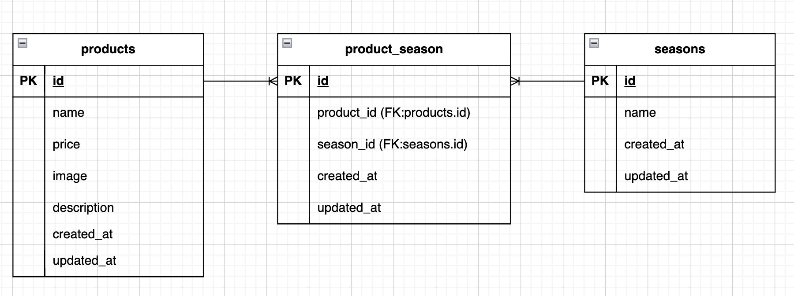

README
	GitHubURL: https://github.com/kajihata-rumi/product-app.git
	アクセスURL: http://localhost/products
	phpMyAdmin: http://localhost:8080

    バリデーション実装箇所
        src/app/Http/Controllers/ProductController.php
    bladeファイル名
        商品一覧・検索: src/resources/views/products/index.blade.php
        商品詳細・更新・削除: src/resources/views/products/detail.blade.php
        商品登録: src/resources/views/products/register.blade.php

0.アプリケーション名
	coachtech もぎたて

1.アプリケーション概要
	商品管理のためのアプリケーション
	#画面ID・画面名・パス
	PG01 商品一覧 /products
	PG02 商品詳細 /products/detail/{productId}
	PG03 商品更新 /products/{productId}/update
	PG04 商品登録 /products/register
	PG05 検索 /products/search
	PG06 削除 /products/{productId}/delete

    PG01:商品一覧
    全商品（ダミーデータ10件）が表示されている
    「商品カード」（商品画像・商品名・値段）が表示されている
    ページネーションを使用し6件ごとの商品を表示することができる
    「+商品を追加」ボタンをクリックすると商品登録ページが開く

    PG02:商品詳細
    「商品カード」をクリックすると商品詳細ページが開く
    （一覧画面・検索結果画面どちらからでも開く）
    商品詳細情報が表示されている（商品名・値段・季節・商品画像・商品説明）
    「戻る」ボタンまたは左上の「商品一覧」をクリックすると商品一覧ページに戻る
    「変更を保存」ボタンをクリックすることで商品情報が変更され商品一覧ページに戻る

    PG03:商品更新
    「変更を保存」ボタンをクリックすることで商品情報が変更されて商品一覧ページに戻る
    「戻る」ボタンをクリックすると一覧ページに戻る
    変更時に季節を複数選択できる
    商品更新時に、必須項目が不足していないか確認できる
    （全ての項目が入力必須）
    必須項目が不足していたらエラーメッセージを赤文字で表示する
    ローカルから商品画像を選択した時にプレビュー表示で確認できる
    商品画像をアップロードできる
    画像はlaravelのstorageディレクトリに保存することができる
    シンボリックリンクを使用した画像保存をすることができる

    PG04:商品登録
    「登録」ボタンをクリックすると新しい商品情報の登録が完了し一覧ページに戻る
    （商品名・値段・季節・商品画像・商品説明）
    「戻る」ボタンをクリックすると一覧ページに戻る
    登録時に季節を複数選択できる
    商品登録時に、必須項目が不足していないか確認できる
    （全ての項目が入力必須）
    必須項目が不足していたらエラーメッセージを赤文字で表示する
    ローカルから商品画像を選択した時にプレビュー表示で確認できる
    商品画像をアップロードできる
    画像はlaravelのstorageディレクトリに保存することができる
    シンボリックリンクを使用した画像保存をすることができる

    PG05:商品検索
    検索ボタンをクリックすると商品名検索と並び替え条件に一致した商品を表示することができる
    商品名で検索ができる
    商品名で部分一致検索ができる
    価格による並び替えができる
    「高い順に表示」と「低い順に表示」から選択することができる
    並び替え結果表示の際に並び替え条件がモーダル表示されている
    並び替え条件の「×」ボタンをクリックすると並び替え検索をリセットすることができる
    検索ボタンをクリックすると商品名検索と並び替え条件に一致した商品を表示することができる
    （価格順表示と商品名検索を同時に行うことができる）

    PG06:商品削除
    赤いゴミ箱アイコンをクリックすると商品情報の削除が完了し一覧ページに戻る
    削除前に確認のダイアログを表示することができる

2.ER図

productsとseasonsは多対多の関係のため、中間テーブルproduct_seasonで管理

3.テーブル構成
	- products
	- seasons
	- product_season（中間テーブル）

	## リレーション
	- products と seasons は多対多の関係
	- product_season テーブルで管理

4.ダミーデータ
	【productsテーブル】商品情報のダミーデータを10件作成
	【seasonsテーブル】季節情報(春・夏・秋・冬)のダミーデータを4件作成

5.使用技術（実行環境）
	- PHP 8.1.34
	- Laravel 10.50.2
	- MySQL 8.0.44
	- nginx 1.21.1
	- Docker 29.2.0
	- Docker Compose v5.0.2
	- Docker Desktop v4.62.0

6.環境構築
    ・クローン
        git clone https://github.com/kajihata-rumi/product-app.git
        cd product-app

    ・コンテナ起動
        docker-compose up -d
        *docker-compose が無い場合は docker compose に読み替えてください

    ・PHPコンテナに入る
        docker-compose exec php bash
        *docker-compose が無い場合は docker compose に読み替えてください

        cd /var/www
        *Laravelプロジェクトルートに移動

    ・依存関係
        composer install

    ・env作成
        cp .env.example .env
        # .env は含まれないので .env.example から作成して下記のDB設定にする

    ・.env のDB設定
        DB_CONNECTION=mysql
        DB_HOST=mysql
        DB_PORT=3306
        DB_DATABASE=laravel_db
        DB_USERNAME=laravel_user
        DB_PASSWORD=laravel_pass

    ・Laravel初期化
        php artisan key:generate

    ・DB初期化 & ダミーデータ投入
        php artisan migrate:fresh --seed
        *既存のデータは削除されます

    ・シーディング
        php artisan db:seed

    ・画像表示のためのシンボリックリンク
        php artisan storage:link
